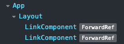

# Next.js 커스텀 앱과 레이아웃

## 커스텀 앱(_app 파일) 컴포넌트 소개
- `_app` 파일은 "Root Component"를 의미
- 페이지 컴포넌트가 그려지기 위해서는 `App` 컴포넌트가 필요하며 `App` 컴포넌트를 커스텀 할 수 있는 파일이 바로 `_app` 파일 = Custom App 컴포넌트
- `home.jsx`와 `login.jsx`에 공통적인 코드가 생긴다면 page 컴포넌트를 뿌리고 있는 상위 컴포넌트(부모 컴포넌트)에 넣어주면 관리하기 쉽다

### 수정 전
```javascript
// login.jsx

function LoginPage() {
    return (
        <div>
            <nav>
                <Link href={"/home"}>Home</Link> | <Link href={"/login"}>Login</Link>
            </nav>
            <div>로그인 페이지</div>
        </div>
    );
}

export default LoginPage;
```

```javascript
// home.jsx

function Homepage() {
    return (
        <div>
            <nav>
                <Link href={"/home"}>Home</Link> | <Link href={"/login"}>Login</Link>
            </nav>
            <div>home</div>
        </div>
    );
}

export default Homepage;
```

```javascript
// _app.jsx

export default function App({ Component, pageProps }) {
    return (
        <div>
            <Component {...pageProps} />
        </div>
    );
}
```

### 수정 후
```javascript
// login.jsx

function LoginPage() {
    return <div>로그인 페이지</div>;
}

export default LoginPage;
```

```javascript
// home.jsx

function Homepage() {
    return <div>home</div>;
}

export default Homepage;
```

```javascript
// _app.jsx

export default function App({ Component, pageProps }) {
    return (
        <div>
            <nav>
                <Link href={"/home"}>Home</Link> | <Link href={"/login"}>Login</Link>
            </nav>
            <Component {...pageProps} />
        </div>
    );
}
```

### 커스텀을 하는 3가지 이유
- 페이지 이동 시 유지할 공통 레이아웃 구성
- 페이지에 추가 데이터 구성
- 전역 CSS 추가

## Layout 컴포넌트 생성 및 적용

```javascript
// Layout.jsx

export default function Layout({ children }) {
    return (
        <div>
            <nav>
                <Link href={"/home"}>Home</Link> | <Link href={"/login"}>Login</Link>
            </nav>
            <div>{children}</div>
        </div>
    );
}
```



- `App`에서 담당하던 UI가 전부 `Layout`컴포넌트에서 관리할 수 있음

## Layout 컴포넌트 개념과 활용 방법
- `Layout` 컴포넌트는 페이지 라우터에서 자주 쓰이는 컴포넌트이자 페이지 구성 패턴
- `Next.js` 에서 `Layout` 컴포넌트는 `/layouts` 폴더 밑에 위치한 컴포넌트를 가리킴

### Layout 컴포넌트 목적
- `Next.js` 에서 페이지마다 공통으로 들어가는 요소를 `Layout` 컴포넌트에 정의하여 코드의 중복을 방지할 수 있음