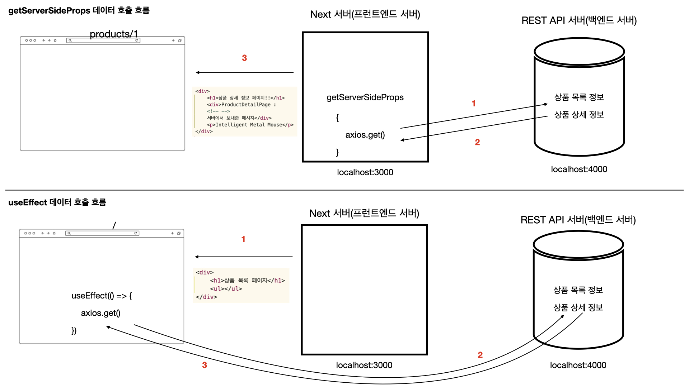

# 실전 프로젝트 - 클라이언트 레벨 데이터 호출 vs 서버 레벨 데이터 호출

## getServerSideProps와 useEffect 데이터 호출 방식 차이점
- "언제, 어디서, 누구를 위해 데이터를 가져오느냐" 차이

### 실행 위치 & 시점
| 구분    | getServerSideProps  | useEffect       |
| ----- | ------------------- | --------------- |
| 실행 위치 | **서버**              | **브라우저(클라이언트)** |
| 실행 시점 | **요청마다 페이지 렌더링 전에** | **렌더링 후**       |
| 실행 주체 | Node.js (Next 서버)   | React (브라우저)    |

### 흐름 비교
#### getServerSideProps
```shell
요청 → 서버에서 데이터 fetch → HTML 생성 → 브라우저 전달
```

#### useEffect
```shell
HTML 먼저 표시 → JS 실행 → 데이터 fetch → 화면 업데이트
```

## getServerSideProps와 useEffect 데이터 호출 흐름 비교



## getServerSideProps와 useEffect의 페이지 로딩 차이

### getServerSideProps
- 첫 화면부터 완성된 데이터
- But! 서버 응답이 느리면 첫 로딩이 느리다

### useEffect
- 화면은 빨리 뜬다
- But! 로딩 UI 필요하고 깜빡임 기능이 있다

## 서버 사이드 렌더링 소개및 CSR과 SSR의 차이점

### Server Side Rendering
- 화면에 표시될 UI를 브라우저가 아닌 서버에서 그리는 행위

### Client Side Rendering
- 빈 HTML 파일이 전송되고 나서 자바스크립트에 의해 빈 페이지의 내용이 채워지는 것

### 언제 SSR(서버 사이드 렌더링)을 써야 할까?
- SSR은 SEO(Search Engine Optimization)라는 검색 엔진 최적화와 SNS에서 웹 서비스 페이지 정보를 풍부하게 표현하고 싶을 때 사용하면 좋음

### SSR(서버 사이드 렌더링의 단점)
- 서버에서 실행되는 코드와 브라우저에서 실행되는 코드 분리
- 빌드, 배포 시간의 증가와 배포된 노드 인스턴스의 모니터링과 관리